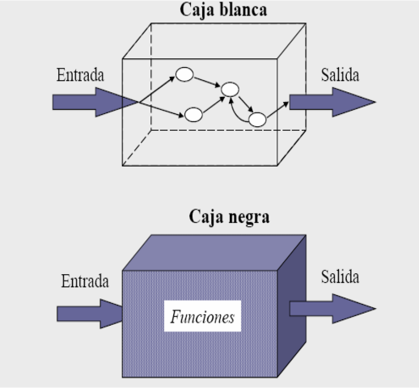

# **Apunts_UF2_1**

## **PROVES**

### **Objectius de les proves**

Les finalitats de fer les proves de software serien:

* Provar si el programari no fa el que ha de fer
* Provar si el programari fa el que no ha de fer.
----------------------

### **Framework**

Un Framework és un esquema o patró que ens ofereix un entorn genèric per a programar en un llenguatge concret.
~~~
Dit d'una altra manera, amb un framework ens trobem un entorn de treball que ens ofereix una forma estàndard de treballar.
~~~

----------------------

### **Forma de les proves**

* **Proves dinàmiques:** Permeten mesurar el comportament de l'aplicació desenvolupada. Requereixen l'execució de l'aplicació.

* **Proves estàtiques:** S'examina el codi font. Es realitzen sense executar el codi de l'aplicació.
----------------------

### **Estratègies de prova**

* **Caixa blanca:** S'examina el codi font i la seva execució. Són proves estructurals.
  * Es treballa sobre la interfície.
  * No es tenen en compte els detalls interns de funcionament.
  * Es proporcionen entrades i s'estudien les sortides.
  * Principals tècniques:
    * Particions d'equivalència.
    * Valors límit.

* **Caixa negra:** S'estudia el sistema des de fora. Són proves de funcionalitat.
  * Es comproven els fluxos d'execució dins de cada unitat (funció, classe, mòdul, etc.)
  * També poden comprovar els fluxos entre unitats durant la integració.
  * I fins i tot entre subsistemes, durant les proves de sistema.
  * Principals tècniques:
    * Cobertura de codi.
    * Prova de bucles.

----------------------

### **Tipus de proves**

* **Funcionals:** Avaluen el compliment dels requisits.
  * Proves unitàries (o d'unitat).
  * Proves de regressió.
  * Proves d'integració.
  * Proves de fum (proba de foc).
  * Proves de sistema.
  * Proves alfa i beta.
  * Proves d'acceptació (validació per part de client).

* **No funcionals:** Avaluen aspectes addicionals com rendiment, seguretat, compatibilitat, ...
  * Proves d'usabilitat.
  * Proves de rendiment.
  * Proves d'estrés.
  * Proves de seguretat.
  * Proves de compatibilitat.
  * Proves de portabilitat.
  * etc...
 ----------------------
 
 ### **Mecanismes de prova**
 
 * **Manual:** Mitjançant proves realitzades per personal de l'empresa o extern.
 
 * **Automàtic:** Mitjançant programari que executa codi de forma automatitzada i compara els resultats obtinguts i els resultats esperats.
 ----------------------
 
## **INTEGRACIÓ**

### **Formes d'integració**

* Integració Big Bang

* integració Descendent

* nintegració Ascendent

* Integració Contínua (CI)
----------------------
 
### **Servidors d'integració contínua**
 
* Jenkins

* Bamboo

* TravisCI

* CircleCI
----------------------
 
### **Cobertura de el codi**
 
* És una mesura que indica el percentatge de codi que ha estat executat durant les proves.

* És aconsellable que sigui el més proper a 100%.

* Si és del 100% llavors s'ha executat tot el codi font durant les proves.

* Si és menor de l'100% llavors existeix codi font que no s'ha executat durant les proves.

* És possible realitzar la cobertura tant des del IDE com des d'un servei web apropiat.
----------------------

## **QUALITAT**

### **Qualitat del procés (QA)**

QA és un conjunt d'activitats per a garantir la qualitat en els processos mitjançant els quals es desenvolupen els productes.

### **Qualitat del producte (QC)**

QC és un conjunt d'activitats per a garantir la qualitat dels productes . Les activitats se centren en identificar defectes en els productes reals produïts.

~~~
La diferencia és que el QA és centra en els metodes un a un i el QC és centra en el producte complet.
~~~
----------------------

### **Factors de qualitat**

**Operació del producte**

* Correcció: Busquem que el software faci la funció que nosaltres volem.

* Fiabilitat: Busquem que el software faci de forma exacta la seva funció totes les vegades que l’executem.

* Eficiència:  Busquem que el software s’executi sobre el nostre hardware el millor que ho pot fer.

* Seguretat:  Busquem que el software sigui segur.

* Facilitat d’ús:  Busquem que el software sigui fàcil per tots d’executar.

**Revisió del producte**

* Mantenibilitat:  Busquem que el software sigui fàcil de reparar si hagués un error.

* Flexibilitat:  Busquem que el software sigui el més flexible possible i el més coherent per teim que modificar-lo.

* Facilitat de prova:  Busquem que el software sigui fàcil de probar-lo quan nosaltres vulguem.

**Transició del producte**

* Portabilitat: Busquem que el software és pugui utilitzar en una altre màquina.

* Reusabilitat: Busquem que el codi és pugui reutilitzar per si de cas volem fer una altre versió.

* Interoperativitat: Busquem que el software és pugui comunicar amb un altre sistema si és necessari.

